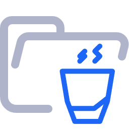
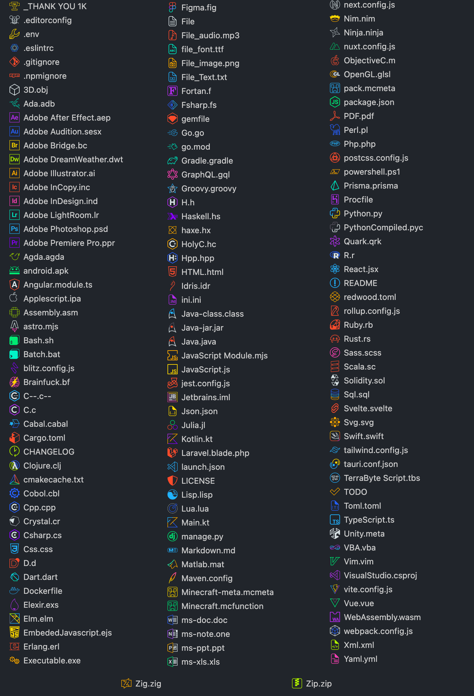
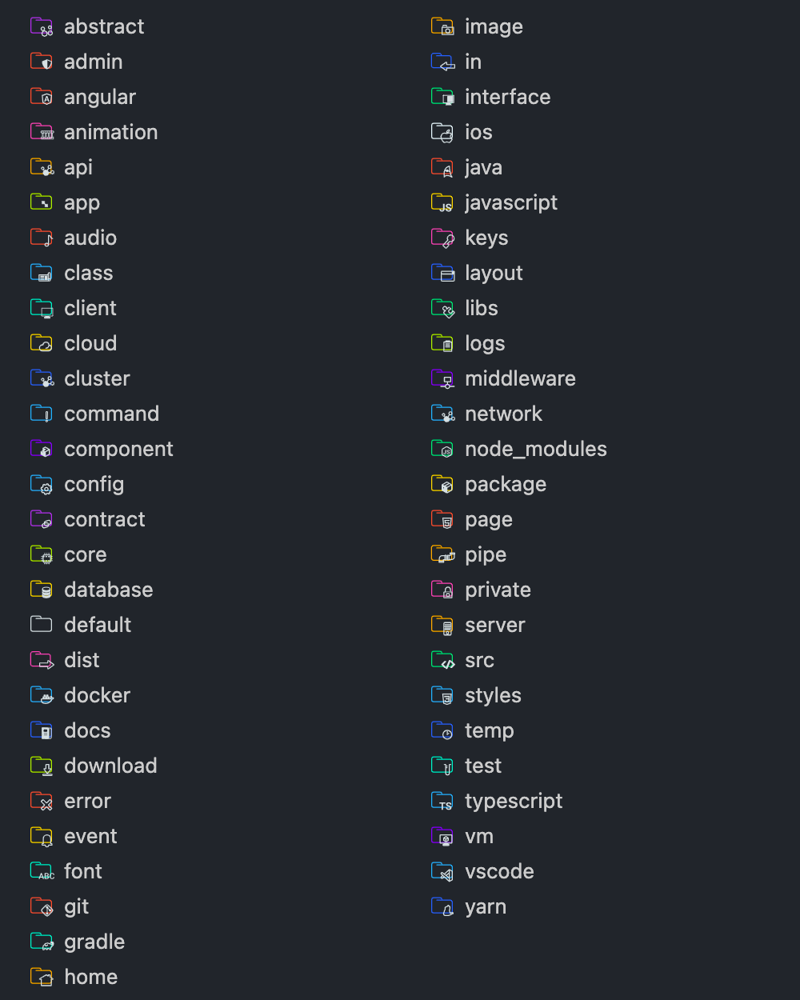

# Ristretto Icons

<!--  -->

VS Code file icons, based on [Catppuccin Latte](https://github.com/catppuccin/vscode-icons/releases)

# Palette

*  `#DC8A78` Rosewater
*  `#DD7878` Flamingo
*  `#EA76CB` Pink
*  `#8839EF` Mauve
*  `#D20F39` Red
*  `#E64553` Maroon
*  `#FE640B` Peach
*  `#DF8E1D` Yellow
*  `#40A02B` Green
*  `#179299` Teal
*  `#04A5E5` Sky
*  `#209FB5` Sapphire
*  `#1E66F5` Blue
*  `#7287FD` Lavender
*  `#8C8FA1` Slate
*  `#4C4F69` Charcoal
<!--
*  #5C5F77: Subtext 1
*  #6C6F85: Subtext 0
*  #9CA0B0: Overlay 0
*  #7C7F93: Overlay 2
*  #CCD0DA: Surface 0
*  #BCC0CC: Surface 1
*  #ACB0BE: Surface 2
*  #EFF1F5: Base
*  #E6E9EF: Mantle
*  #DCE0E8: Crust
https://catppuccin.com/palette/
-->

<!-- # Currently available icons (deprecated)

 -->
